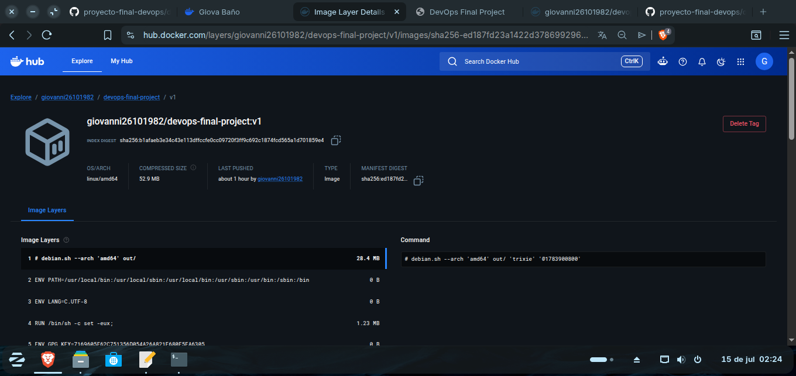
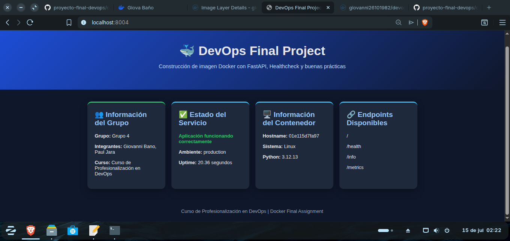

# Informe del Trabajo Final DevOps

## 1. Datos del grupo

- **Grupo:** Grupo 4
- **Integrantes:**
  - Giovanni Xavier Baño Jaya
  - César Paúl Jara Pauta
- **Usuario GitHub:** `PaulJara84`
-  `Giovanni26101982`
- **Usuario Docker Hub:** `pauljara84`
- **Correo GitHub utilizado en Git:** `PaulJara84@github.com`
-  `Giovanni26101982@github.com`
- **Sistema operativo:** Ubuntu de 64 bits
- **Repositorio GitHub:** `https://github.com/PaulJara84/proyecto-final-devops`
-  `https://github.com/Giovanni26101982/proyecto-final-devops`
- **Repositorio Docker Hub:** `https://hub.docker.com/r/pauljara84/devops-final-project`
- **Imagen publicada:** `pauljara84/devops-final-project:v1`

## 2. Objetivos

### Objetivo general

Aplicar prácticas DevOps mediante Git, GitFlow, GitHub Actions y Docker para versionar una aplicación FastAPI, automatizar la construcción de su imagen y publicarla en Docker Hub.

### Objetivos específicos

- Organizar el desarrollo con las ramas `main`, `develop`, `feature` y `release`.
- Construir una imagen Docker reproducible mediante un `Dockerfile` multi-stage.
- Publicar automáticamente la imagen `pauljara84/devops-final-project:v1`.
- Ejecutar el contenedor con variables de entorno correspondientes al Grupo 4.
- Verificar el estado `healthy` y los endpoints de la aplicación.

## 3. Estructura del proyecto

```text
proyecto-final-devops/
├── .github/workflows/dockerhub.yml
├── app/main.py
├── app/templates/index.html
├── docs/evidencias/
├── .dockerignore
├── Dockerfile
├── INFORME.md
├── README.md
└── requirements.txt
```

La aplicación se encuentra en `app/main.py`, mientras que la plantilla HTML está almacenada en `app/templates/index.html`. El archivo `Dockerfile` copia el directorio `app/` dentro de `/app` en el contenedor.

## 4. Configuración de Git y GitFlow

El repositorio se inicializó con `main` como rama de producción y `develop` como rama de integración. El desarrollo se realizó mediante ramas `feature`, y la versión se consolidó mediante una rama `release`.

Configuración utilizada:

```bash
git config --global user.name "César Paúl Jara Pauta"
git config --global user.email "PaulJara84@github.com"
```

## 5. Agregación de contenido e historial de commits

Se utilizaron mensajes de commit descriptivos, por ejemplo:

```text
chore: inicializar repositorio
feat: agregar aplicación FastAPI y plantilla web
build: agregar configuración Docker
ci: publicar imagen v1 en Docker Hub
docs: completar informe técnico y evidencias
```

Para presentar el historial se ejecutó:

```bash
git log --oneline --graph --decorate --all
```

> Reemplace este texto con el resultado final del comando si el instructor lo solicita.

## 6. Creación del versionamiento con release

La versión se preparó con GitFlow:

```bash
git flow release start v1
git flow release finish -m "Release v1" v1
```

El proceso integró la versión en `main`, sincronizó los cambios con `develop` y creó la etiqueta `v1`.

## 7. Publicación en GitHub

El repositorio fue publicado en:

```text
https://github.com/PaulJara84/proyecto-final-devops
```

Se enviaron las ramas y etiquetas mediante:

```bash
git push -u origin main
git push -u origin develop
git push origin --tags
```

## 8. Configuración de GitHub Actions

El workflow `.github/workflows/docker-publish.yml` realiza las siguientes operaciones:

1. Descarga el código del repositorio.
2. Configura Docker Buildx.
3. Se autentica en Docker Hub mediante una variable y un secreto.
4. Construye la imagen con el `Dockerfile`.
5. Publica `pauljara84/devops-final-project:v1`.

Configuración en GitHub:

- Variable `DOCKERHUB_USERNAME`: `pauljara84`
- Secreto `DOCKERHUB_TOKEN`: token de acceso de Docker Hub.

## 9. Publicación en Docker Hub

La imagen publicada corresponde a:

```text
pauljara84/devops-final-project:v1
```

### Evidencia 1: imagen publicada en Docker Hub

`docs/evidencias/dockerhub-v1.png`.



## 10. Ejecución del contenedor

```bash
docker run -d \
  --name devops-final-project-grupo4 \
  -p 8004:8000 \
  -e GROUP_NAME="Grupo 4" \
  -e GROUP_MEMBERS="Giovanni Xavier Baño Jaya, César Paúl Jara Pauta" \
  -e COURSE_NAME="Curso de Profesionalización en DevOps" \
  pauljara84/devops-final-project:v1
```

El puerto `8004` fue asignado al Grupo 4 y se enlazó con el puerto interno `8000`.

## 11. Verificación de la imagen

```bash
docker image ls | grep devops-final-project
```

Resultado esperado:

```text
pauljara84/devops-final-project   v1   <IMAGE_ID>   <FECHA>   <TAMAÑO>
```

Los valores de identificador, fecha y tamaño varían según la construcción.

## 12. Verificación del contenedor

```bash
docker ps -a --filter "name=devops-final-project-grupo4"
```

Verificación específica del healthcheck:

```bash
docker inspect \
  --format='{{.State.Health.Status}}' \
  devops-final-project-grupo4
```

Resultado esperado:

```text
healthy
```

## 13. Pruebas de funcionamiento

Página principal:

```text
http://localhost:8004
```

Pruebas de endpoints:

```bash
curl http://localhost:8004/health
curl http://localhost:8004/info
curl http://localhost:8004/metrics
```

### Evidencia 2: página inicial del contenedor

`docs/evidencias/aplicacion-grupo4.png`



## 14. Resultados

La aplicación FastAPI fue empaquetada en una imagen Docker, publicada con la etiqueta `v1` y ejecutada en el puerto `8004`. Las variables de entorno permitieron visualizar los datos del Grupo 4 sin modificar el código fuente. El healthcheck verificó la disponibilidad del endpoint `/health`, y los endpoints `/info` y `/metrics` entregaron la información prevista.

> Antes de entregar, confirme que estas afirmaciones coincidan con las pruebas realmente realizadas y registre cualquier incidencia encontrada.

## 15. Conclusiones

- GitFlow permitió separar el desarrollo, la integración y la versión de producción.
- GitHub Actions automatizó la construcción y publicación de la imagen, reduciendo tareas manuales.
- Docker permitió ejecutar la aplicación de forma consistente con variables de entorno configurables.
- El healthcheck ofreció una verificación automática del estado del servicio.
- La imagen `pauljara84/devops-final-project:v1` puede ser descargada y validada por el instructor en otro equipo.
